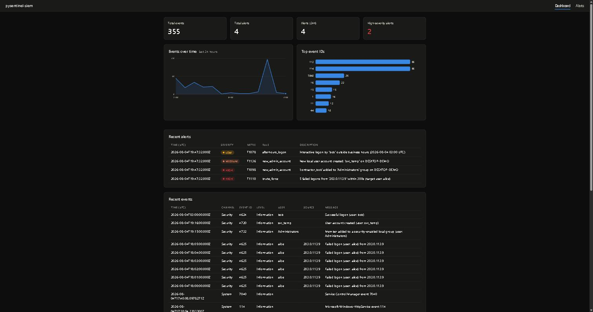
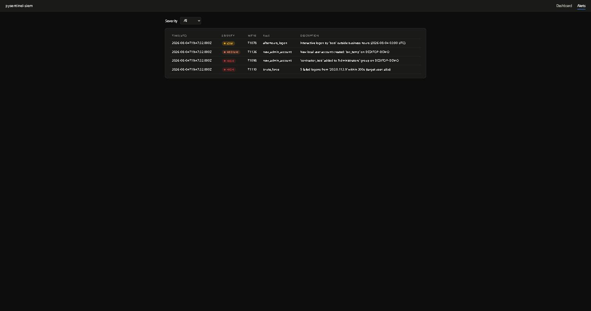

# pysentinel-siem

A lightweight SIEM (Security Information and Event Management) system, built from scratch in Python, that runs on a single Windows host. It collects Windows Event Log telemetry, stores it, evaluates it against MITRE ATT&CK-mapped detection rules, and surfaces alerts through a local web dashboard.



## Why

Built as a hands-on companion to CompTIA Security+ study: rather than only reading about SIEM concepts (log normalization, correlation rules, detection engineering), this implements a minimal but real version of one, end to end, on my own machine.

## Architecture

```
Windows Event Log (Security, System)         Sysmon (Microsoft-Windows-Sysmon/Operational)
              \_______________________  ________________________/
                                      \/
                              siem/collector.py
                        (pywin32 Evt* API, polls channels,
                     per-channel watermark for safe resume)
                                      |
                                      v
                              siem/normalize.py
                     (raw event XML -> common schema dict)
                                      |
                                      v
                               siem/storage.py  (SQLite: events, alerts)
                                      |
                                      v
                                siem/engine.py
                      (runs each new event through siem/rules/*)
                                      |
                      rule match --> siem/alerts.py --> alerts table
                                      |
                                      v
                              dashboard/app.py (Flask)
                    localhost web UI: live events, alerts, charts
```

Two independent long-running processes share one SQLite file:
- **`run_collector.py`** — the only writer. Must run elevated (reading the `Security` and Sysmon channels requires admin rights).
- **`run_dashboard.py`** — read-only web UI, no admin rights needed.

Sysmon is wired in as just another Windows Event Log channel — `siem/collector.py` doesn't know or care that it's a different telemetry source, since both Sysmon and the classic channels are read through the same `win32evtlog` Evt* API.

## Detections (MITRE ATT&CK-mapped)

| Rule | Trigger | Technique | Severity |
|---|---|---|---|
| `brute_force` | N failed logons (4625) from the same source within a time window | [T1110 – Brute Force](https://attack.mitre.org/techniques/T1110/) | High |
| `new_admin_account` | New local account created (4720) | [T1136 – Create Account](https://attack.mitre.org/techniques/T1136/) | Medium |
| `new_admin_account` | Account added to the `Administrators` group (4732) | [T1098 – Account Manipulation](https://attack.mitre.org/techniques/T1098/) | High |
| `afterhours_logon` | Interactive/RDP logon (4624) outside configured business hours | [T1078 – Valid Accounts](https://attack.mitre.org/techniques/T1078/) | Low |
| `encoded_powershell` | PowerShell launched with `-enc`/`-EncodedCommand` (Sysmon event 1) | [T1059.001 – PowerShell](https://attack.mitre.org/techniques/T1059/001/) | High |
| `suspicious_parent_child` | Office app (Word/Excel/PowerPoint/Outlook) spawns a shell or script interpreter (Sysmon event 1) | [T1059 – Command and Scripting Interpreter](https://attack.mitre.org/techniques/T1059/) | High |

All thresholds and business hours are configurable in `config.yaml`. Business hours are evaluated in UTC to avoid timezone/DST ambiguity — see `siem/rules/afterhours_logon.py`.

## Screenshots

| Dashboard | Alerts |
|---|---|
|  |  |

## Setup

Requires Python 3.10+ on Windows.

```
python -m venv .venv
.venv\Scripts\activate
pip install -r requirements.txt
```

Review `config.yaml` — channels watched, detection thresholds, poll interval, and the SQLite file path all live there.

**Sysmon** (required for the `encoded_powershell` and `suspicious_parent_child` rules): install it with the [SwiftOnSecurity baseline config](https://github.com/SwiftOnSecurity/sysmon-config), from an elevated terminal:
```
cd sysmon
.\Sysmon64.exe -accepteula -i sysmonconfig-export.xml
```
Verify it's readable (also needs elevation — Sysmon's channel has the same restrictive ACL as Security):
```
python sysmon\check_access.py
```

## Running it

Two separate processes, both from the project root with the venv active:

**Collector** (needs an elevated/Administrator terminal, since it reads the `Security` channel):
```
python run_collector.py
```

**Dashboard** (regular terminal, no elevation needed):
```
python run_dashboard.py
```

Then open **http://127.0.0.1:5000**.

## Testing

```
pytest
```

Unit tests cover event normalization and all six detection rules with synthetic event sequences — no real Windows Event Log access required, so they run anywhere (including CI).

## Roadmap

- [x] Phase 0 — project scaffold
- [x] Phase 1 — Windows Event Log collector + SQLite storage
- [x] Phase 2 — detection engine + MITRE ATT&CK-mapped rules
- [x] Phase 3 — Flask web dashboard
- [x] Phase 4 — Sysmon integration (process-creation, suspicious parent/child rules)
- [x] Phase 5 — polish, screenshots, MITRE coverage table

## License

MIT
